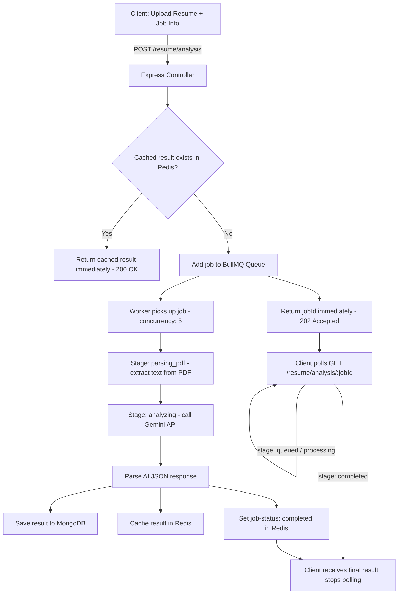

# ResumePilot — Backend

AI-powered resume ATS analysis and optimization API. Analyzes resumes against a target job, scores ATS compatibility, and generates truthful, AI-optimized resumes — without fabricating skills, experience, or achievements the candidate doesn't actually have.

> Frontend repo: `resumepilot-frontend` (link it here once published)

---

## Table of Contents

- [Overview](#overview)
- [Features](#features)
- [Tech Stack](#tech-stack)
- [System Architecture](#system-architecture)
- [How Resume Analysis Works](#how-resume-analysis-works)
- [How Resume Optimization Works](#how-resume-optimization-works)
- [API Endpoints](#api-endpoints)
- [Project Structure](#project-structure)
- [Getting Started](#getting-started)
- [Environment Variables](#environment-variables)
- [Roadmap](#roadmap)

---

## Overview

Resume analysis and optimization are AI/CPU-heavy operations that can take 10–30 seconds. Rather than blocking the HTTP request for that long, this API processes jobs asynchronously through a queue, and exposes a polling endpoint for live status updates — the same pattern used by tools like Midjourney or video-rendering platforms.

The core design constraint: **the AI can restructure, clarify, and highlight — but it can never fabricate.** Every optimization is traceable back to something that already existed in the original resume; anything it can't truthfully support is logged separately instead of being silently added.

---

## Features

- 📄 **PDF Resume Parsing** — extracts raw text from any uploaded PDF resume
- 🎯 **ATS Match Scoring** — 0–100 score against a specific job title + description
- 🔑 **Keyword Gap Analysis** — found vs. missing keywords, mapped to the job description
- 📝 **Section-by-Section Breakdown** — Contact Info, Education, Experience, Projects, each rated Good/Normal/Weak/Missing
- ✅ **User-Confirmed Optimization** — only user-confirmed missing keywords/improvements are ever added to the resume
- 🤖 **AI-Optimized Resume Generation** — produces an improved resume PDF, uploaded and served via Cloudinary
- ⚡ **Async Job Queue** — resume analysis and optimization run as background jobs (BullMQ), not blocking API responses
- 💾 **Smart Caching** — identical resume + job title + job description combinations are served from Redis cache instead of re-calling the AI
- 🔐 **JWT Authentication** — all resume routes are protected

---

## Tech Stack

| Layer | Technology |
|---|---|
| Runtime / Framework | Node.js, Express |
| Database | MongoDB (Mongoose) |
| Cache / Job Status Store | Redis |
| Job Queue | BullMQ |
| AI | Google Gemini API |
| File Storage | Cloudinary |
| PDF Parsing | pdf-parse |
| PDF Generation | Custom PDF generation service |
| Validation | Zod |
| Auth | JWT |

---

## System Architecture

Resume analysis and optimization both follow the same async pattern: **API → Queue → Worker → Redis Status → Client Polling.**



### Why this architecture instead of a simple synchronous API call?

| Approach | Problem |
|---|---|
| Synchronous (`await` the whole analysis in one request) | Client blocked for 10–30s; server connection held open; poor UX under load |
| **Queue + Worker + Polling (this project)** | API responds instantly with a job ID; heavy AI/PDF work happens in the background; multiple resumes process in parallel (concurrency: 5); client gets live progress updates |

---

## How Resume Analysis Works

1. Client uploads a PDF resume + target job title + job description
2. API generates a cache key from a hash of `(resume content + job title + job description)`
3. If that exact combination was analyzed before (within the last 10 minutes), the cached result is returned instantly
4. Otherwise, a job is queued and the worker:
   - Parses the PDF into raw text
   - Sends a structured prompt to Gemini with strict anti-hallucination rules
   - Receives a JSON response: ATS score, keyword match, formatting score, section-by-section status, strengths, and top improvements
   - Saves the result to MongoDB and Redis
5. The client polls `/resume/analysis/:jobId` every ~1.5s until `stage: "completed"`

---

## How Resume Optimization Works

1. From the analysis results, the client sends back only the items the user genuinely confirmed as true — missing keywords, weak/missing sections, and recommended improvements
2. A second worker:
   - Rewrites the resume using only the original content + confirmed additions
   - Refuses to add any keyword/skill it cannot truthfully support from the original resume (logged in `skipped_improvements`)
   - Re-scores the new resume against the same job description
   - Generates a downloadable PDF and uploads it to Cloudinary
3. The client polls the optimization job the same way, then receives a before/after ATS score comparison and a download URL

---

## API Endpoints

| Method | Endpoint | Description |
|---|---|---|
| POST | `/resume/analysis` | Upload resume + job info, returns `jobId` (or cached result) |
| GET | `/resume/analysis/:jobId` | Poll analysis job status/result |
| POST | `/resume/improve/:resumeId` | Submit confirmed keywords/improvements, returns `jobId` |
| GET | `/resume/improve/status/:jobId` | Poll optimization job status/result |

All routes require a valid JWT (`Authorization: Bearer <token>`).

---

## Project Structure

```
src/
├── controllers/       # Request handlers
├── services/          # Business logic (ResumeAnalysis, ResumeImprove)
├── Queues/             # BullMQ queue definitions
├── workers/            # Background job processors
├── models/              # Mongoose schemas
├── middleware/         # Auth, file upload, validation
├── validation/         # Zod schemas
└── utils/                 # Redis helpers, API response/error wrappers
```

---

## Getting Started

### Prerequisites
- Node.js 18+
- MongoDB instance
- Redis instance
- Google Gemini API key
- Cloudinary account

### Setup

```bash
npm install

# starts the API server
npm run dev

# starts the background workers (run as a separate process)
npm run worker
```

Both the API server and the worker process must be running for jobs to actually be processed — the API only queues jobs, the worker executes them.

---

## Environment Variables

```env
MONGO_URI=
DB_NAME=
REDIS_URL=
GEMINI_API_KEY=
CLOUDINARY_CLOUD_NAME=
CLOUDINARY_API_KEY=
CLOUDINARY_API_SECRET=
JWT_SECRET=
```

---

## Roadmap

- [ ] AI-powered mock interview with voice input/output (Whisper + Gemini + ElevenLabs)
- [ ] Job portal with recruiter/candidate/admin roles (RBAC)
- [ ] Multi-resume comparison against a single job posting
- [ ] Resume version history

---

## License

This project is currently private/personal. License terms to be added.
